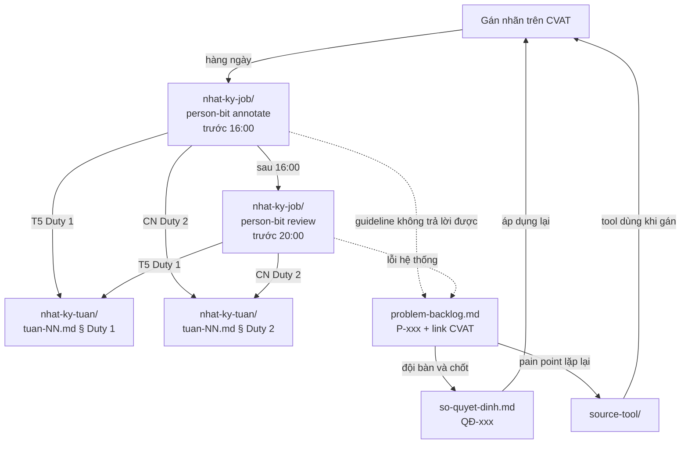

# Repo đội — Cohort 4A

Repos làm việc của một đội gán nhãn. Mỗi đội nhận một bản sao của template này.

> Tên người, handle GitHub, số liệu và link CVAT trong các file mẫu đều là **giả**,
> chỉ để minh hoạ cách ghi. Thay bằng dữ liệu của đội khi bắt đầu.

## Có gì trong repo

| Đường dẫn | Dùng để | Cập nhật khi nào |
|---|---|---|
| [`nhat-ky-tuan/`](nhat-ky-tuan/) | Big report theo tuần: phân công, Duty 1 (T5) + Duty 2 (CN), tổng kết | Đầu tuần phân công, T5/CN tổng hợp |
| [`nhat-ky-tuan/nhat-ky-job/`](nhat-ky-tuan/nhat-ky-job/) | **Person-bit** hàng ngày: `*-annotate.md` + `*-review-*.md` (link chéo). Viết prose tự nhiên, see [`WRITE_GUIDE.md`](nhat-ky-tuan/nhat-ky-job/WRITE_GUIDE.md) | **Hàng ngày** — annotate trước 16:00, review trước 20:00 |
| [`phan-cong-review.md`](phan-cong-review.md) | Vòng review cố định + tracking 3 tuần | Đầu đợt, cập nhật T7/CN |
| [`problem-backlog.md`](problem-backlog.md) | Edge case gặp khi gán nhãn mà guideline chưa trả lời được, kèm link CVAT | **Ngay khi gặp** |
| [`so-quyet-dinh.md`](so-quyet-dinh.md) | Những gì đội đã chốt, và vì sao | Mỗi lần chốt một vấn đề |
| [`source-tool/`](source-tool/) | Source code công cụ đội tự viết để gỡ pain point khi gán nhãn | Khi đã xác định được pain point đáng làm tool |

## Các file nối với nhau thế nào



**Luồng person-bit → duty:** `nhat-ky-job/*-annotate + *-review` (hàng ngày, link chéo) → aggregate vào `nhat-ky-tuan/tuan-NN.md` § Duty 1 (T5) và § Duty 2 (CN).

## Vị trí trong đội

| Vị trí | Việc chính |
|---|---|
| **Lead** | Chia job, điều phối, đưa edge case ra bàn và chốt, giữ sổ quyết định |
| **Annotator** | Gán nhãn theo guideline; gặp chỗ guideline không trả lời được thì ghi vào backlog thay vì tự đoán |
| **Reviewer** | Kiểm job đã gán, trả lại chỗ sai kèm lý do |

Một người có thể giữ nhiều vị trí, nhưng **không review job do chính mình gán**.

## Cách làm việc (cadence T2→CN)

| Ngày | Việc | Deadline | Ai |
|---|---|---|---|
| **T2** | Nhận Job — Lead chia batch (25+25 / người, nhóm trưởng chỉ 25 / 1 task) | T2 cuối ngày | Lead |
| **T3** | Gán đợt 1 — person-bit annotate | **16:00** | Mỗi người |
|  | Review đợt 1 — person-bit review (vòng cố định) | **20:00** | Reviewer |
| **T4** | Nộp phần đầu (**làm nhiêu nộp bấy**) + person-bit | 16:00 / 20:00 | Mỗi người |
|  | Review T4 phải xong để họp T5 | **21:00 T4** | Reviewer |
| **T5** | **Mentor Duty 1** — họp online, trình bày report Duty 1 (tổng hợp T2→T4) | T5 | Lead + cả đội |
| **T6** | Gán đợt 2 — person-bit | 16:00 / 20:00 | Mỗi người |
| **T7** | **Đóng batch — nộp hết job trước 20:00** + person-bit | 16:00 / **20:00** | Mỗi người |
| **CN** | **Mentor Duty 2** — chốt tuần, report Duty 2 (T6→T7) | CN | Lead |

### Batch & vòng review

- **Batch:** 25 ảnh / task / người = **50 ảnh/tuần/người**.
  Nhóm trưởng chỉ làm 25 ảnh nhưng vẫn review đủ 50 của người trước.
- **Vòng review cố định 3 tuần:** `HHuy → Long → PHuy → Mạnh → Cường → HHuy` — xem [`phan-cong-review.md`](phan-cong-review.md). Không tự review, không đổi vòng giữa chừng.
- **Ảnh tệ (terrible match):** Annotator đề xuất trong `*-annotate.md`, reviewer đồng ý/không trong `*-review-*.md`. Chưa có guideline thì chưa tự bỏ — chờ chốt ở Duty 1/2 thành `QĐ-xxx`.

### Person-bit hàng ngày (trong `nhat-ky-job/`)

```
nhat-ky-tuan/nhat-ky-job/
├── WRITE_GUIDE.md              # hướng dẫn viết person-bit cho annotator/reviewer
├── _mau-annotate.md            # mẫu
├── _mau-review.md              # mẫu
├── hhuy-annotate.md            # HHuy log phần mình (tên file chứa ngày)
├── long-review-hhuy.md       # Long review HHuy (theo vòng)
├── long-annotate.md
├── phuy-review-long.md
└── …
```

Mỗi `*-annotate.md` có metadata (date, reviewer handle, cross-link), numbers, and free-form prose sections. Mỗi `*-review-*.md` có metadata, numbers, verdict, and free-form prose. **Link chéo bắt buộc** cùng ngày — annotate → review và review → annotate. File có ngày trong tên, không cần folder ngày riêng.

**Cách viết:** Viết bằng **ngôn ngữ tự nhiên**, không cần điền bảng hay checkbox cứng. Đảm bảo capture đủ 4 thông tin bắt buộc: (1) số ảnh done/total, (2) link CVAT frame cho ảnh tệ, (3) blocker/P-xxx, (4) verdict (review). Agent của mentor sẽ parse prose để extract structured data. Xem [`WRITE_GUIDE.md`](WRITE_GUIDE.md) cho ví dụ chi tiết.

## Quy ước

- **Mã**: `P-001`, `QĐ-001`, đánh số tăng dần. Không dùng lại số của mục đã bỏ.
- **Nhắc người**: bằng handle GitHub, ví dụ `@thanh-vien-a` (hiện để `@empty`, thay khi có handle thật).
- **Link CVAT**: trỏ tới đúng job và frame (`.../jobs/<id>?frame=<n>`), không trỏ tới cả task — người đọc phải mở ra là thấy ngay chỗ có vấn đề.
- **Mục guideline**: ghi số mục (`§3.2`) để ai cũng tra lại được.
- **Person-bit**: `*-annotate.md` trước **16:00**, `*-review-*.md` trước **20:00** (T4 review trước **21:00** để họp T5). Link chéo cùng ngày bắt buộc.
- **Nộp T4**: làm nhiêu nộp bấy. **T7**: đóng batch trước 20:00.
- **Vòng review:** `HHuy → Long → PHuy → Mạnh → Cường → HHuy` — cố định 3 tuần.
